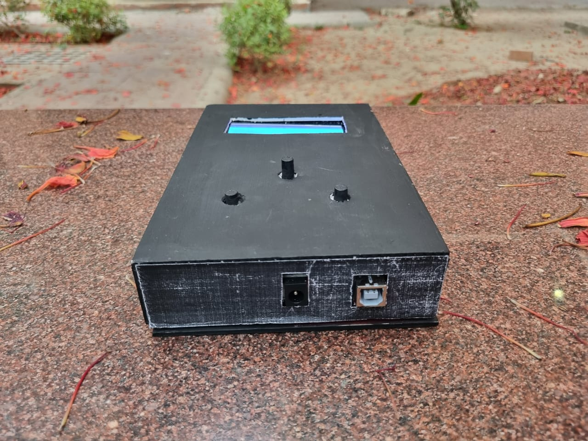
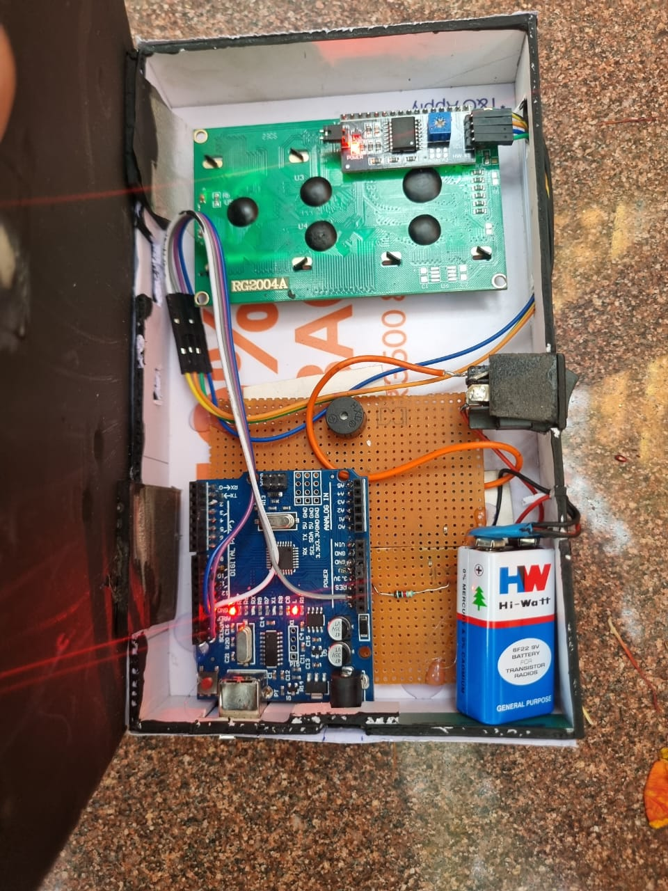

# 🐍 Snake Game — Arduino + LCD

A handheld Snake game built from scratch on Arduino, displayed on a 16x2 LCD using custom characters.

▶️ [Play in browser on Wokwi](https://wokwi.com/projects/395392073511015425)

## Hardware
- Arduino Uno
- 16x2 LCD via I2C protocol
- Passive buzzer
- 2 tactile push buttons
- 9V battery

## OOP Design
The code is structured into 4 classes:

| Class | Responsibility |
|-------|---------------|
| `Snake` | Body positions, movement, collision detection |
| `Apple` | Position, respawn avoiding snake body |
| `Display` | LCD buffer management, custom character rendering |
| `Game` | Owns all classes via composition, runs the game loop |

## Key Concepts
- Encapsulation — private data, public methods
- Composition over Inheritance
- Const references to avoid copying on limited RAM
- uint8_t unsigned wrap for wall collision detection
